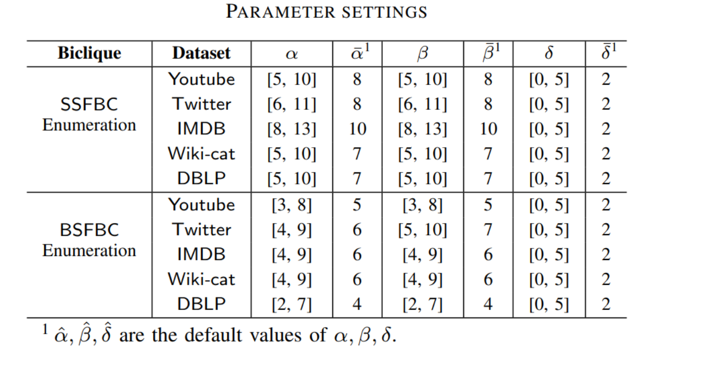

# fairnesss-biclique

### 编译命令

```
cd ./cmake-build-debug
make
```

### SSFBC Enumeration

```
./MBEA ../dataset-name/ 1 alpha beta delta vertex_order algorithm
```

#### vertex_order

0: random order

1: Descend degree vertex order 

2: Ascend degree vertex order

#### algorithm

1: baseline
2: improved

### BSFBC Enumeration
```
./MBEA ../dataset-name/ 2 alpha beta delta vertex_order algorithm
```

### Parameters


